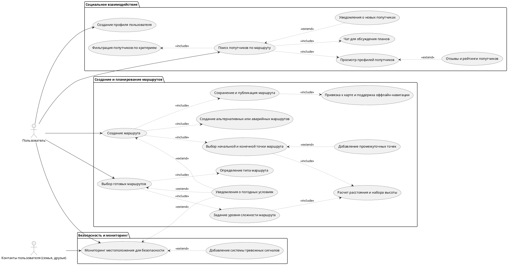

## Диаграмма

## Описание Use Case
### 1. Выбор существующих маршрутов

- **Описание:** Пользователь может выбирать из списка существующих маршрутов, которые были загружены другими пользователями. Эти    маршруты будут содержать подробную информацию, такую как описание, уровень сложности, точки интереса и отзывы других пользователей.

- **Акторы:** Пользователь (путешественник)

- **Основной поток:**

  1. Пользователь входит в систему.

  2. Переходит в раздел существующих маршрутов.

  3. Выбирает маршрут из списка, используя фильтры (уровень сложности, длительность, отзывы).

  4. Система отображает детали маршрута на интерактивной карте.

  5. Пользователь может добавить выбранный маршрут в свои запланированные походы.

- **Приоритет:** Средний

### 2. Создание маршрутов
- **Описание:** Пользователь создает маршрут, указывая начальную точку, конечную точку и промежуточные точки, а также продолжительность и планируемую дату поездки.

- **Акторы:** Пользователь (путешественник)

- **Основной поток:**

  1. Пользователь входит в систему.

  2. Открывает раздел "Создание маршрута".

  3. Вводит необходимые данные (начало, конец, промежуточные точки, даты, предпочтения).

  4. Система предлагает оптимальный маршрут на основе введенных данных и показывает карту.

  5. Пользователь сохраняет маршрут.

- **Альтернативный поток:** Если данные введены некорректно, система уведомляет пользователя об ошибке и предлагает ввести корректные данные.

- **Приоритет:** Высокий
