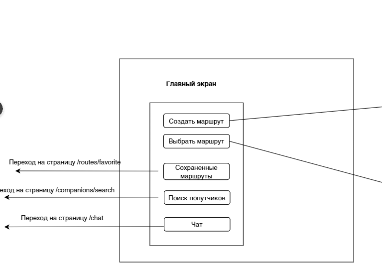

## Главный экран
**Назначение:** ...

---
| Источник данных | Атрибуты                            | Триггер вызова      | Примечания                                                               |
| --------------- | ----------------------------------- | ------------------- | ------------------------------------------------------------------------ |
| Сервис реакций  | Список реакций (иконки, количество) | Открытие публикации | Реакции обновляются в реальном времени при взаимодействии пользователей. |

---

**Ссылка на API:** [тык](https://google.com)

**Ссылка на макет:** [тык](https://google.com)

## Создание маршрута

**Назначение:** ...

---
| Источник данных | Атрибуты                            | Триггер вызова      | Примечания                                                               |
| --------------- | ----------------------------------- | ------------------- | ------------------------------------------------------------------------ |
| Сервис реакций  | Список реакций (иконки, количество) | Открытие публикации | Реакции обновляются в реальном времени при взаимодействии пользователей. |

---

**Элементы:** ...

**Ссылка на API:** [тык](https://google.com)

**Ссылка на макет:** [тык](https://google.com)

