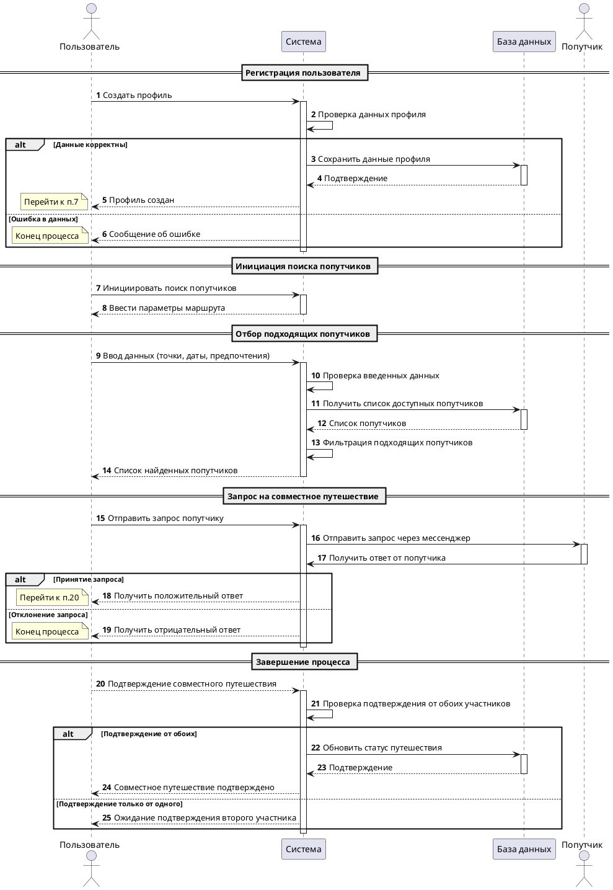

# Поиск попутчиков

### Участники сценария

| Система      | Описание                           |
| ------------ | ---------------------------------- |
| Система      | Система, отвечающая за системность |
| База данных  | Базовая базовость                  |
| Пользователь | Отвечает за пользование            |
| Попутчик     | Отвечает за попутчество            |
---

### Диаграмма

---
### Описание сценария использования

1. **User** создает профиль, отправляя запрос `POST /v1/user`.
2. **System** проверяет данные
3. **System** сохраняет данные в **Database**.

